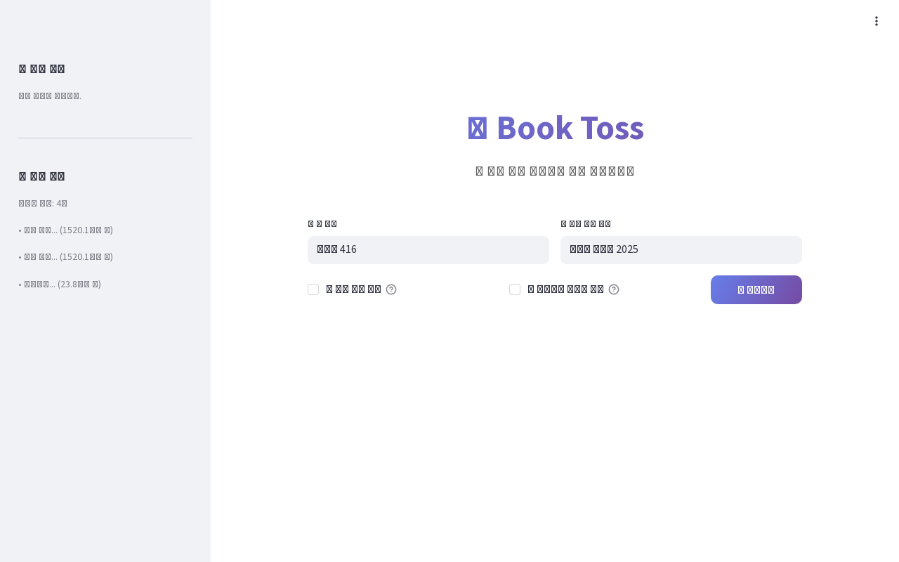

# portfolio-bithabit

This repository contains the static portfolio site for <https://bit-habit.com>.

## Purpose

- Serve a simple personal portfolio page
- Keep the site easy to edit and deploy
- Host the live landing page for `bit-habit.com`

## Live Site

<https://bit-habit.com>

## Screenshot



## Files

```text
.
├── index.html
├── screenshots/
└── archive/
```

- `index.html`: main page
- `screenshots/`: images used on the page
- `archive/`: old files kept for reference

## Deployment

This is a plain static site.

- k3s ingress routes `bit-habit.com` to `static-web-svc`
- Nginx serves the files
- The server mounts this working directory directly

When `index.html` or the images change here, the live site changes too.

## Notes

- No framework or build step
- Most edits happen in `index.html`
- Unused files should go into `archive/`
