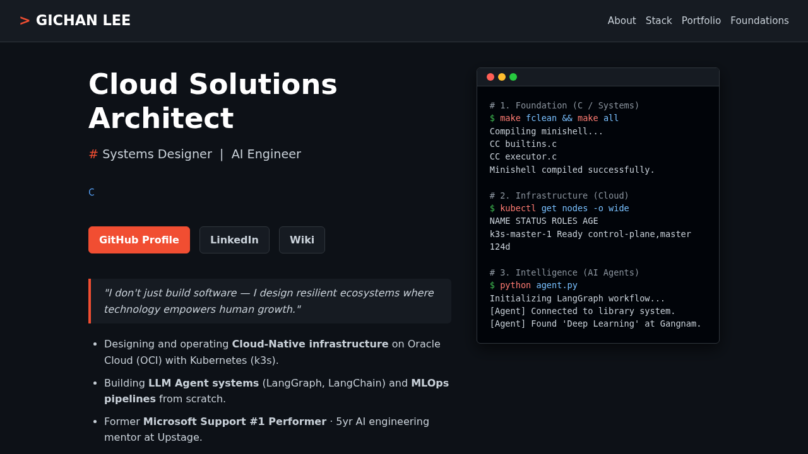

# portfolio-bithabit

This repository contains the static portfolio site for <https://bit-habit.com>.

## Purpose

- Serve a simple personal portfolio page
- Keep the site easy to edit and deploy
- Host the live landing page for `bit-habit.com`

## Live Site

<https://bit-habit.com>

## Screenshot



## Files

```text
.
├── index.html
├── screenshots/
└── archive/
```

- `index.html`: main page
- `screenshots/`: images used on the page
- `archive/`: old files kept for reference

## Tailoring the page to a job posting

One `index.html` serves every application. The page re-aims itself from the URL — no copies, no branches.

| Param | Effect |
|---|---|
| `?title=` | Free text. The hero introduces you as exactly that job title. |
| `?focus=` | Reorders sections and project cards. `default` · `fde` · `edu` · `solutions` · `infra` |
| `?role=` | Switches between four fixed titles. Drives the footer's "view as another role" toggle. |
| `?lang=` | `ko` · `en` |

`?title=` overrides `?role=`. For an application, `?title=` is the one to use — paste the posting's own
job title and the page matches it, whatever the role. Encode it: space → `%20`, `/` → `%2F`.

```
https://bit-habit.com/?focus=infra&title=DevOps%20%2F%20SRE%20Engineer
```

Links in use:

| Application | URL |
|---|---|
| General | `https://bit-habit.com` |
| AI Solutions Engineer (Upstage) | `?focus=solutions&role=solutions` |
| DevOps / SRE (LG U+ DAX) | `?focus=infra&title=DevOps%20%2F%20SRE%20Engineer` |
| Education / DevRel | `?focus=edu` |

An unknown `?focus=` value falls back to the default order **silently**. Open the finished link and
check the intended card is on top before sending it anywhere.

## Deployment

This is a plain static site — no framework, no build step.

**Editing files here does not change the live site.** Deploy is a push:

```
git push origin master
```

GitHub Actions (`.github/workflows/deploy.yml`) then SSHes into the server, which `git pull`s its own
clone at `~/workspace/static-web`. Nginx serves that folder via a hostPath mount; k3s ingress routes
`bit-habit.com` → `static-web-svc` → Nginx.

## Notes

- Most edits happen in `index.html` (HTML, CSS, and JS all live inline)
- Unused files should go into `archive/` rather than being deleted
